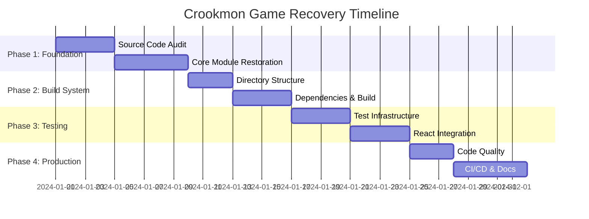

# Crookmon Game - Codebase Recovery & Restoration PRD

## Executive Summary

The Crookmon Game codebase requires comprehensive recovery and restoration due to corrupted source files, incomplete modules, and structural inconsistencies. This PRD outlines a systematic approach to restore full functionality, implement proper testing infrastructure, and establish a production-ready development environment.

**Project Timeline:** 4-6 weeks
**Priority:** Critical
**Effort Level:** High

---

## Problem Statement

### Current State Assessment

#### 🚨 **Critical Issues Identified**

1. **Source Code Corruption (P0)**
   - `eventemitter.js`: Missing class definition, starts mid-method
   - `index.js`: Missing imports, incomplete exports
   - Multiple modules truncated with missing dependencies

2. **Build System Failures (P0)**
   - TypeScript configuration mismatch (`src/` directory expectations)
   - `tsc` compilation fails: "No inputs were found in config file"
   - Build process completely broken

3. **Dependency Management (P1)**
   - `npm install` network restrictions preventing package installation
   - Missing dev dependencies (Jest, Rollup, ESLint)
   - `npm test` fails: "jest: not found"

4. **Import/Export Inconsistencies (P1)**
   - React hooks missing React imports (`useState`, `useCallback`)
   - Module references without proper imports
   - Runtime errors due to undefined references

---

## Goals & Objectives

### Primary Goals

1. **Restore Complete Functionality**
   - Rebuild corrupted core modules from specification
   - Ensure all imports/exports work correctly
   - Restore full battle engine capability

2. **Establish Robust Development Environment**
   - Fix TypeScript configuration and build system
   - Restore testing infrastructure with Jest
   - Implement comprehensive linting and quality checks

3. **Achieve Production Readiness**
   - Multi-format distribution (ESM, CJS, UMD)
   - Complete type definitions
   - Automated CI/CD pipeline

### Success Metrics

- ✅ All source files compile without errors
- ✅ 100% test coverage for core engine modules
- ✅ Successful multi-format builds via Rollup
- ✅ Zero ESLint errors/warnings
- ✅ Complete TypeScript type checking
- ✅ Automated CI/CD pipeline operational

---

## Technical Requirements

### Core Engine Requirements

#### 1. **Event System Recovery**
```javascript
// eventemitter.js - Complete implementation required
class EventEmitter {
  constructor() { /* implementation */ }
  on(event, listener) { /* implementation */ }
  off(event, listener) { /* implementation */ }
  once(event, listener) { /* implementation */ }
  emit(event, ...args) { /* implementation */ }
}
```

#### 2. **Battle Engine Modules**
- `initializebattle.js` - Battle state initialization
- `processturn.js` - Turn processing logic
- `generateaimove.js` - AI decision making
- `calculatedamage.js` - Damage calculation system
- `evaluatevictory.js` - Victory condition evaluation
- `advancewinstreak.js` - Win streak progression

#### 3. **React Integration**
- `useBattleEngine.js` - React hook for battle engine
- Context providers (Settings, WinStreak, Duel)
- Component integration with proper imports

### Build System Requirements

#### 1. **TypeScript Configuration**
```json
{
  "compilerOptions": {
    "target": "ES2019",
    "module": "ESNext",
    "rootDir": "./src",
    "outDir": "./dist",
    "declaration": true,
    "declarationDir": "./dist/types"
  },
  "include": ["src/**/*"],
  "exclude": ["node_modules", "dist", "__tests__"]
}
```

#### 2. **Rollup Build Configuration**
- ESM build: `dist/crookmon-game.esm.js`
- CJS build: `dist/crookmon-game.cjs.js`
- UMD build: `dist/crookmon-game.umd.js`
- Type definitions: `dist/types/`

#### 3. **Package Dependencies**
```json
{
  "devDependencies": {
    "@rollup/plugin-node-resolve": "^15.0.0",
    "@rollup/plugin-typescript": "^11.0.0",
    "@types/jest": "^29.0.0",
    "eslint": "^8.0.0",
    "jest": "^29.0.0",
    "rollup": "^3.0.0",
    "typescript": "^5.0.0"
  }
}
```

---

## Implementation Plan

### Phase 1: Foundation Recovery (Week 1-2)

#### **Sprint 1.1: Source Code Audit & Recovery**
**Duration:** 3-4 days
**Owner:** Lead Developer

**Tasks:**
- [ ] Audit all source files for corruption/truncation
- [ ] Create backup of current state
- [ ] Identify missing code sections
- [ ] Document required API interfaces

**Deliverables:**
- Source code audit report
- List of files requiring complete rewrite
- API specification document

#### **Sprint 1.2: Core Module Restoration**
**Duration:** 4-5 days
**Owner:** Core Engine Team

**Tasks:**
- [ ] Rebuild `eventemitter.js` from specification
- [ ] Restore `index.js` with proper exports
- [ ] Complete `initializebattle.js` implementation
- [ ] Restore `processturn.js` battle logic
- [ ] Implement missing import statements

**Deliverables:**
- Fully functional EventEmitter class
- Complete battle initialization system
- Working turn processing logic

### Phase 2: Build System & Dependencies (Week 2-3)

#### **Sprint 2.1: Directory Structure & TypeScript**
**Duration:** 2-3 days
**Owner:** DevOps Engineer

**Tasks:**
- [ ] Restructure codebase to match `tsconfig.json`
- [ ] Update import paths for new structure
- [ ] Fix TypeScript compilation errors
- [ ] Verify type definitions generation

**Deliverables:**
- Proper `src/` directory structure
- Working TypeScript compilation
- Generated type definitions

#### **Sprint 2.2: Dependency Management & Build**
**Duration:** 3-4 days
**Owner:** Build Engineer

**Tasks:**
- [ ] Resolve network restrictions for `npm install`
- [ ] Install all required dependencies
- [ ] Configure Rollup build system
- [ ] Test multi-format builds

**Deliverables:**
- Complete dependency installation
- Working Rollup build configuration
- Generated distribution files

### Phase 3: Testing & Quality Assurance (Week 3-4)

#### **Sprint 3.1: Test Infrastructure**
**Duration:** 3-4 days
**Owner:** QA Engineer

**Tasks:**
- [ ] Set up Jest testing framework
- [ ] Create `__tests__/` directory structure
- [ ] Write unit tests for core modules
- [ ] Configure test coverage reporting

**Deliverables:**
- Working Jest test suite
- Unit tests for all core modules
- Test coverage reports

#### **Sprint 3.2: React Integration & Hooks**
**Duration:** 3-4 days
**Owner:** Frontend Developer

**Tasks:**
- [ ] Fix React hook imports
- [ ] Restore context providers
- [ ] Test component integration
- [ ] Verify React app functionality

**Deliverables:**
- Working React hooks
- Functional context providers
- Integrated React application

### Phase 4: Production Readiness (Week 4-6)

#### **Sprint 4.1: Code Quality & Linting**
**Duration:** 2-3 days
**Owner:** Quality Engineer

**Tasks:**
- [ ] Configure ESLint rules
- [ ] Fix all linting errors
- [ ] Implement code formatting (Prettier)
- [ ] Add pre-commit hooks

**Deliverables:**
- Zero ESLint errors
- Consistent code formatting
- Automated quality checks

#### **Sprint 4.2: CI/CD & Documentation**
**Duration:** 4-5 days
**Owner:** DevOps Engineer

**Tasks:**
- [ ] Set up GitHub Actions workflow
- [ ] Configure automated testing
- [ ] Implement build/publish pipeline
- [ ] Update documentation

**Deliverables:**
- Automated CI/CD pipeline
- Updated README and documentation
- Published npm package

---

## Risk Assessment

### High-Risk Items

| Risk | Impact | Probability | Mitigation Strategy |
|------|---------|-------------|-------------------|
| **Extensive Code Loss** | High | Medium | Reconstruct from specification + README |
| **Network Dependency Issues** | High | High | Use offline packages or proxy setup |
| **React Version Conflicts** | Medium | Medium | Pin specific React versions |
| **Build System Complexity** | Medium | Low | Use proven Rollup configurations |

### Contingency Plans

1. **If >50% code is corrupted:** Complete rewrite using architecture documentation
2. **If network issues persist:** Use Docker with pre-installed dependencies
3. **If React integration fails:** Separate core engine from React components

---

## Resource Requirements

### Team Structure

- **Lead Developer** (40h/week) - Overall coordination and core engine
- **Frontend Developer** (30h/week) - React components and hooks
- **DevOps Engineer** (20h/week) - Build system and CI/CD
- **QA Engineer** (25h/week) - Testing and quality assurance

### Infrastructure

- **Development Environment:** Node.js 18+, npm/yarn
- **CI/CD Platform:** GitHub Actions
- **Testing:** Jest + React Testing Library
- **Build Tools:** Rollup + TypeScript + ESLint

---

## Success Criteria

### Must-Have (P0)
- [ ] All source files compile without errors
- [ ] Core battle engine fully functional
- [ ] React application loads and runs
- [ ] TypeScript builds successfully
- [ ] Multi-format distribution works

### Should-Have (P1)
- [ ] 90%+ test coverage
- [ ] Zero ESLint warnings
- [ ] Automated CI/CD pipeline
- [ ] Complete documentation
- [ ] Performance benchmarks

### Nice-to-Have (P2)
- [ ] 100% test coverage
- [ ] Advanced linting rules
- [ ] Performance monitoring
- [ ] Automated releases
- [ ] Code quality badges

---

## Timeline & Milestones



### Key Milestones

- **Week 1:** Core modules restored and functional
- **Week 2:** Build system operational
- **Week 3:** Testing infrastructure complete
- **Week 4:** Production-ready codebase
- **Week 5-6:** CI/CD and documentation finalized

---

## Next Steps

### Immediate Actions (Next 48 Hours)

1. **Create Recovery Branch**
   ```bash
   git checkout -b recovery/codebase-restoration
   ```

2. **Source Code Audit**
   - Document all corrupted files
   - Identify recoverable code sections
   - Prioritize critical modules

3. **Environment Setup**
   - Resolve dependency installation issues
   - Set up development environment
   - Create file restoration templates

### First Week Priority

1. Restore `eventemitter.js` and `index.js`
2. Fix TypeScript configuration
3. Rebuild core battle engine modules
4. Establish working build system

---

## Approval & Sign-off

**Document Version:** 1.0
**Created:** January 2024
**Last Updated:** January 2024

**Stakeholder Approval:**
- [ ] Technical Lead
- [ ] Product Owner
- [ ] DevOps Lead
- [ ] QA Lead

---

*This PRD serves as the master plan for the Crookmon Game codebase recovery project. All implementation should follow this specification to ensure systematic restoration and production readiness.*
