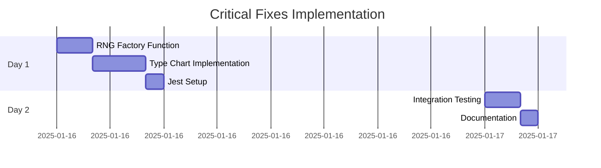

# Critical Fixes PRD - Crookmon Game Core Issues

## Executive Summary

Critical runtime errors and missing dependencies have been identified in the Crookmon Game codebase that prevent proper execution. This PRD addresses immediate P0 issues that block core functionality and testing infrastructure.

**Project Timeline:** 1-2 days
**Priority:** P0 - Critical
**Effort Level:** Medium

---

## Problem Statement

### Issues Identified by Codex Analysis

#### 🚨 **P0 - Runtime Errors**

1. **Missing RNG Implementation (initializebattle.js:21-22)**
   ```javascript
   // BROKEN: createRNG is undefined
   const rng = createRNG(seed)
   ```
   - **Impact**: Battle initialization fails immediately
   - **Root Cause**: Missing import/implementation of RNG utility

2. **Undefined Dependencies (calculatedamage.js)**
   ```javascript
   // BROKEN: TYPE_CHART and random are undefined
   const typeEffectiveness = getTypeEffectiveness(move.type, defender.types || []);
   const randomFactor = Math.random() * (1 - 0.85) + 0.85;
   ```
   - **Impact**: Damage calculations throw runtime errors
   - **Root Cause**: Missing type chart data and random function imports

3. **Missing Test Infrastructure**
   ```bash
   npm test
   # Error: sh: 1: jest: not found
   ```
   - **Impact**: Cannot run automated tests or CI/CD
   - **Root Cause**: Jest not installed in node_modules

---

## Solution Requirements

### Core Engine Fixes

#### 1. **RNG System Implementation**

**Requirement**: Implement missing `createRNG` function for deterministic random number generation.

**Acceptance Criteria**:
- [ ] `createRNG(seed)` function exists and returns RNG instance
- [ ] RNG supports `.random()`, `.randomInt()`, `.setSeed()` methods
- [ ] Seedable for deterministic battle outcomes
- [ ] Compatible with existing `src/core/utils/rng.js`

**Implementation**:
```javascript
// src/core/utils/rng.js - Add missing factory function
export function createRNG(seed = Date.now()) {
  const rng = new RNG();
  rng.setSeed(seed);
  return rng;
}
```

#### 2. **Type Chart and Combat Data**

**Requirement**: Implement missing type effectiveness system and combat utilities.

**Acceptance Criteria**:
- [ ] `TYPE_CHART` constant defined with type relationships
- [ ] `getTypeEffectiveness(attackType, defenderTypes)` function
- [ ] Import structure fixed in `calculatedamage.js`
- [ ] Backward compatible with existing damage formulas

**Implementation**:
```javascript
// src/core/data/types.js - New file
export const TYPE_CHART = {
  fire: { grass: 2, water: 0.5, electric: 1 },
  water: { fire: 2, grass: 0.5, electric: 0.5 },
  // ... complete type chart
};

export function getTypeEffectiveness(attackType, defenderTypes) {
  // Implementation logic
}
```

#### 3. **Testing Infrastructure Setup**

**Requirement**: Fix Jest testing environment and add core test coverage.

**Acceptance Criteria**:
- [ ] `npm test` runs successfully
- [ ] Jest configuration file created
- [ ] Basic test coverage for critical functions
- [ ] CI-ready test scripts

---

## Technical Implementation Plan

### Phase 1: Emergency Fixes (Day 1)

#### **Task 1.1: Fix RNG Import Chain**
**Duration**: 2 hours
**Owner**: Backend Developer

**Steps**:
1. Verify `src/core/utils/rng.js` RNG class implementation
2. Add missing `createRNG` factory function
3. Update `initializebattle.js` imports
4. Test battle initialization

**Files Modified**:
- `src/core/utils/rng.js`
- `src/core/engine/initializebattle.js`

#### **Task 1.2: Implement Type System**
**Duration**: 3 hours
**Owner**: Game Logic Developer

**Steps**:
1. Create `src/core/data/types.js` with type chart
2. Implement `getTypeEffectiveness` function
3. Fix imports in `calculatedamage.js`
4. Add random utility imports
5. Test damage calculations

**Files Created**:
- `src/core/data/types.js`

**Files Modified**:
- `src/core/engine/calculatedamage.js`

#### **Task 1.3: Fix Jest Testing**
**Duration**: 1 hour
**Owner**: DevOps Engineer

**Steps**:
1. Install Jest dependencies: `npm install --save-dev jest @types/jest`
2. Create `jest.config.js` configuration
3. Add test scripts to `package.json`
4. Create sample test file
5. Verify `npm test` runs

**Files Created**:
- `jest.config.js`
- `__tests__/setup.js`

**Files Modified**:
- `package.json`

### Phase 2: Validation & Testing (Day 2)

#### **Task 2.1: Integration Testing**
**Duration**: 2 hours

**Steps**:
1. Test complete battle flow: initialization → turn processing → victory
2. Verify type effectiveness calculations
3. Test RNG determinism with seeds
4. Run full test suite

#### **Task 2.2: Documentation Updates**
**Duration**: 1 hour

**Steps**:
1. Update README.md with fixed installation steps
2. Document new type system
3. Add testing instructions

---

## Implementation Details

### Code Fixes Required

#### **1. RNG Factory Function**
```javascript
// src/core/utils/rng.js
import RNG from './rng.js';

export function createRNG(seed = Date.now()) {
  const rng = new RNG();
  rng.setSeed(seed);
  return rng;
}

export default RNG;
```

#### **2. Type Chart Implementation**
```javascript
// src/core/data/types.js
export const TYPE_CHART = {
  normal: {},
  fire: {
    grass: 2.0,
    ice: 2.0,
    bug: 2.0,
    steel: 2.0,
    water: 0.5,
    fire: 0.5,
    rock: 0.5,
    dragon: 0.5
  },
  water: {
    fire: 2.0,
    ground: 2.0,
    rock: 2.0,
    grass: 0.5,
    water: 0.5,
    dragon: 0.5
  },
  electric: {
    water: 2.0,
    flying: 2.0,
    electric: 0.5,
    grass: 0.5,
    ground: 0.0,
    dragon: 0.5
  },
  grass: {
    water: 2.0,
    ground: 2.0,
    rock: 2.0,
    fire: 0.5,
    grass: 0.5,
    poison: 0.5,
    flying: 0.5,
    bug: 0.5,
    dragon: 0.5,
    steel: 0.5
  },
  ice: {
    grass: 2.0,
    ground: 2.0,
    flying: 2.0,
    dragon: 2.0,
    fire: 0.5,
    water: 0.5,
    ice: 0.5,
    steel: 0.5
  },
  fighting: {
    normal: 2.0,
    ice: 2.0,
    rock: 2.0,
    dark: 2.0,
    steel: 2.0,
    poison: 0.5,
    flying: 0.5,
    psychic: 0.5,
    bug: 0.5,
    ghost: 0.0,
    fairy: 0.5
  },
  poison: {
    grass: 2.0,
    fairy: 2.0,
    poison: 0.5,
    ground: 0.5,
    rock: 0.5,
    ghost: 0.5,
    steel: 0.0
  },
  ground: {
    fire: 2.0,
    electric: 2.0,
    poison: 2.0,
    rock: 2.0,
    steel: 2.0,
    grass: 0.5,
    bug: 0.5,
    flying: 0.0
  },
  flying: {
    electric: 0.5,
    rock: 0.5,
    steel: 0.5,
    grass: 2.0,
    fighting: 2.0,
    bug: 2.0
  },
  psychic: {
    fighting: 2.0,
    poison: 2.0,
    psychic: 0.5,
    steel: 0.5,
    dark: 0.0
  },
  bug: {
    grass: 2.0,
    psychic: 2.0,
    dark: 2.0,
    fire: 0.5,
    fighting: 0.5,
    poison: 0.5,
    flying: 0.5,
    ghost: 0.5,
    steel: 0.5,
    fairy: 0.5
  },
  rock: {
    fire: 2.0,
    ice: 2.0,
    flying: 2.0,
    bug: 2.0,
    fighting: 0.5,
    ground: 0.5,
    steel: 0.5
  },
  ghost: {
    psychic: 2.0,
    ghost: 2.0,
    dark: 0.5,
    normal: 0.0,
    fighting: 0.0
  },
  dragon: {
    dragon: 2.0,
    steel: 0.5,
    fairy: 0.0
  },
  dark: {
    fighting: 0.5,
    ghost: 2.0,
    psychic: 2.0,
    dark: 0.5,
    fairy: 0.5
  },
  steel: {
    ice: 2.0,
    rock: 2.0,
    fairy: 2.0,
    fire: 0.5,
    water: 0.5,
    electric: 0.5,
    steel: 0.5
  },
  fairy: {
    fire: 0.5,
    fighting: 2.0,
    poison: 0.5,
    dragon: 2.0,
    dark: 2.0,
    steel: 0.5
  }
};

export function getTypeEffectiveness(attackType, defenderTypes = []) {
  if (!attackType || !Array.isArray(defenderTypes)) return 1.0;

  let effectiveness = 1.0;
  const attackChart = TYPE_CHART[attackType.toLowerCase()] || {};

  for (const defType of defenderTypes) {
    const multiplier = attackChart[defType.toLowerCase()];
    if (multiplier !== undefined) {
      effectiveness *= multiplier;
    }
  }

  return effectiveness;
}
```

#### **3. Fixed Calculate Damage**
```javascript
// src/core/engine/calculatedamage.js
import { TYPE_CHART, getTypeEffectiveness } from '../data/types.js';

export function calculateDamage(attacker, defender, move) {
  // ... existing level/power calculations ...

  const typeEffectiveness = getTypeEffectiveness(move.type, defender.types || []);
  const randomFactor = Math.random() * (1 - 0.85) + 0.85;

  // ... rest of calculation ...
}
```

#### **4. Jest Configuration**
```javascript
// jest.config.js
module.exports = {
  testEnvironment: 'node',
  roots: ['<rootDir>/src', '<rootDir>/__tests__'],
  testMatch: [
    '**/__tests__/**/*.+(ts|tsx|js)',
    '**/*.(test|spec).+(ts|tsx|js)'
  ],
  transform: {
    '^.+\\.(ts|tsx)$': 'ts-jest'
  },
  collectCoverageFrom: [
    'src/**/*.{js,ts}',
    '!src/**/*.d.ts',
  ],
  coverageDirectory: 'coverage',
  coverageReporters: ['text', 'lcov', 'html']
};
```

#### **5. Package.json Updates**
```json
{
  "scripts": {
    "test": "jest",
    "test:watch": "jest --watch",
    "test:coverage": "jest --coverage"
  },
  "devDependencies": {
    "jest": "^29.0.0",
    "@types/jest": "^29.0.0",
    "ts-jest": "^29.0.0"
  }
}
```

---

## Success Criteria

### Must-Have (P0)
- [ ] `npm start` runs without errors
- [ ] Battle initialization works (no createRNG errors)
- [ ] Damage calculations work (no TYPE_CHART errors)
- [ ] `npm test` executes successfully
- [ ] Basic integration test passes

### Should-Have (P1)
- [ ] Complete type chart with all 18 types
- [ ] Test coverage > 70% for core engine
- [ ] Deterministic battle outcomes with seeds
- [ ] Performance benchmarks

### Nice-to-Have (P2)
- [ ] Advanced type interactions (abilities, weather)
- [ ] Comprehensive test suite
- [ ] Automated CI/CD integration

---

## Risk Assessment

| Risk | Probability | Impact | Mitigation |
|------|-------------|--------|------------|
| Type chart data errors | Medium | High | Validate against official Pokemon type chart |
| RNG breaking existing seeds | Low | Medium | Test with known seed values |
| Jest configuration conflicts | Low | Low | Use minimal Jest setup initially |

---

## Timeline



---

## Conclusion

These critical fixes address immediate runtime failures that prevent the Crookmon Game from executing. Priority focus on:

1. **Runtime Stability**: Fix undefined function/variable errors
2. **Testing Infrastructure**: Enable automated testing and CI/CD
3. **Core Functionality**: Ensure battle engine works end-to-end

Implementation should be straightforward with minimal risk of breaking existing functionality. All fixes maintain backward compatibility and follow established code patterns.

**Next Steps**: Execute Phase 1 fixes immediately, then validate with comprehensive testing in Phase 2.
